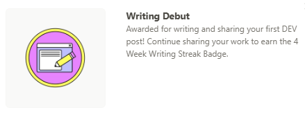
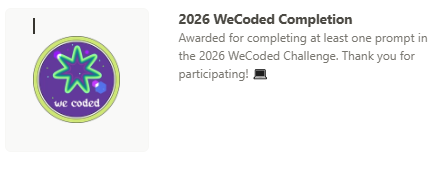

# Urooj Fatima

### AI/ML Engineer in the Making • Building with LLMs, RAG & Computer Vision

 

## 👋 About Me

I'm an Electrical Engineering student at NUST who taught herself AI/ML from the ground up — and now builds real, working products with it: RAG chatbots, computer vision systems, and AI-powered apps that solve actual problems.

I care about shipping things that work, not just following tutorials — every project below is deployed, documented, and open source.

## 🛠 Tech Stack

**AI / ML**

**Backend & Deployment**

**Hardware / EE**

**Also comfortable with:** OOP • NLP • Deep Learning • Generative AI • n8n • WordPress • UI/UX • Digital Marketing

## 🚀 Featured Projects

### 🤖 [DocMind AI](https://github.com/uroojbuilds/Docmind-Ai)
RAG-based document chatbot — upload documents and query them in natural language.
`Python` `FastAPI` `LangChain` `Groq` `Pinecone`

### 🎯 [Weapon Detection System](https://github.com/uroojbuilds/Computer-Vision/tree/main/weapon-detection)
Real-time custom 9-class weapon detection with an audio alarm trigger on detection.
`YOLOv8` `OpenCV` `Python`

### 🧬 [PassionDNA AI](https://github.com/uroojbuilds/passiondna-ai)
Maps a user's interests to potential career/passion paths — built for the DEV Weekend Challenge.
`Streamlit` `Google Gemini` `Python`

### 🩺 [Diabetes Care AI](https://github.com/uroojbuilds/Diabetes-Care-Ai)
ML-powered diabetes risk assessment and care assistant.
`Python` `Machine Learning`

### 📊 [Customer Churn Prediction](https://github.com/uroojbuilds/Machine-learning/tree/main/customer-churn-prediction)
End-to-end ML pipeline predicting customer churn from behavioral data.
`Python` `Scikit-learn`

## 🗂 Additional Projects (Previous Account)

12 more hands-on ML/AI practice projects — click to expand

 

- [Movie Recommender System](https://github.com/Urooj25/Movie-Recommender-System)
- [Movie Review Sentiment Analysis](https://github.com/Urooj25/Movie-review-sentiment-analysis)
- [News Detection Model](https://github.com/Urooj25/News_Detection_Model)
- [Fashion Deep Learning Model](https://github.com/Urooj25/Fashion_deeplearning_model)
- [AI Chatbot Project](https://github.com/Urooj25/AI-CHATBOT-PROJECT)
- [CodeAlpha FAQ Chatbot](https://github.com/Urooj25/CodeAlpha_FAQ_Chatbot)
- [CodeAlpha Object Detection](https://github.com/Urooj25/CodeAlpha_ObjectDetection)
- [CodeAlpha Music Generation AI](https://github.com/Urooj25/CodeAlpha_Music_Generation_AI)
- [Study Planner AI](https://github.com/Urooj25/Study_Planner_Ai)
- [Language Translator](https://github.com/Urooj25/LANGUAGE_TRANSLATOR)
- [Your Health Assistant](https://github.com/Urooj25/Your-Health-Assistent)
- [Student Performance ML Project](https://github.com/Urooj25/student-performance-ML-project)

## 🏆 Hackathons & Challenges

- 🎓 **University Campus Ambassador** — Alkhidmat AI Hackathon (Alibaba Cloud x Alkhidmat Foundation Pakistan)
- 🩹 **DEV Summer Bug Smash** *(in progress)* — "Clear the Lineup" track, submitted fixes from DocMind AI (CORS bug, requirements.txt encoding fix); result pending
- 🧬 **DEV Weekend Challenge** — built and shipped PassionDNA AI
- ☁️ **Alibaba Cloud Hackathon** (Alkhidmat Foundation) — registered, building an education-focused project

**Dev.to Badges:**

✍️ Writing Debut &nbsp;•&nbsp; 💻 2026 WeCoded Completion

## 📜 Certifications

- [Coursera — API, LLM, Agentic AI, MCP & Multi-Model concepts (via n8n)](https://coursera.org/share/be96ef279e74ea7f34c4d6e5cf2ce65e)
- [Coursera — IoT for Everyone](https://coursera.org/share/8e9dc78692b29200f72b37aca2b1b6b5)
- DigiSkills — Digital Marketing ([verify](https://digiskills.pk/verify/) with ID: `MWJ689HMK`)
- DigiSkills — Freelancing ([verify](https://digiskills.pk/verify/) with ID: `8F9YE2PMK`)
- DigiSkills — UI/UX & Webflow ([verify](https://digiskills.pk/verify/) with ID: `SJYA2CBMK`)
- DigiSkills — WordPress ([verify](https://digiskills.pk/verify/) with ID: `XQSNGUXMK`)
- Bano Qabil — Generative AI Program (voluntary work completed, certificate pending)
- Duke University — MLOps Specialization *(in progress)*

**Currently learning:** Data Structures & Algorithms • MLOps • Arduino • Prompt Engineering

## 📊 GitHub Stats

> 💡 Earlier work (300+ commits) lives on my previous account — [Urooj25](https://github.com/Urooj25) — migrated key projects here after losing access to it.

## 📫 Connect With Me

⭐ Thanks for stopping by — always open to collaborating on AI/ML projects!

